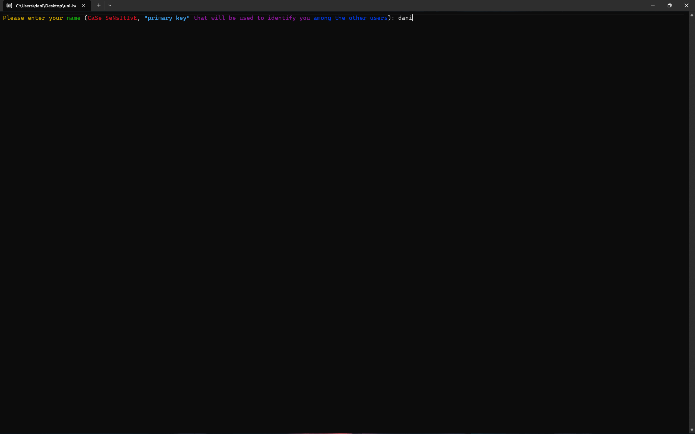
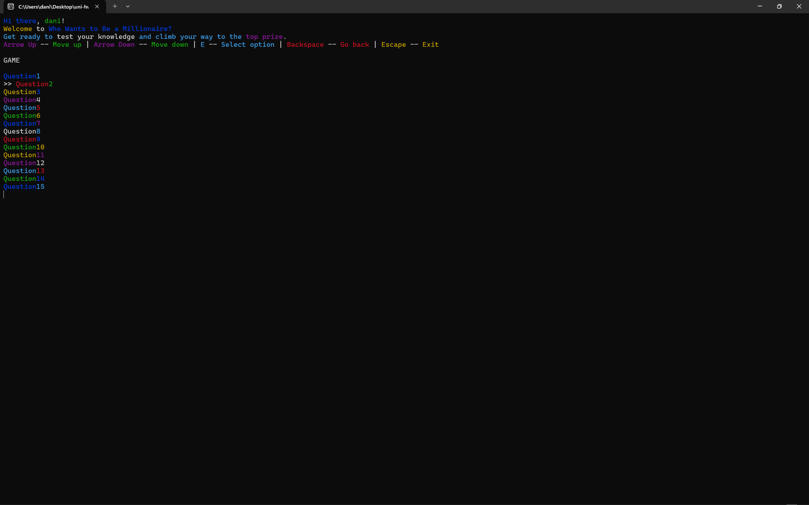
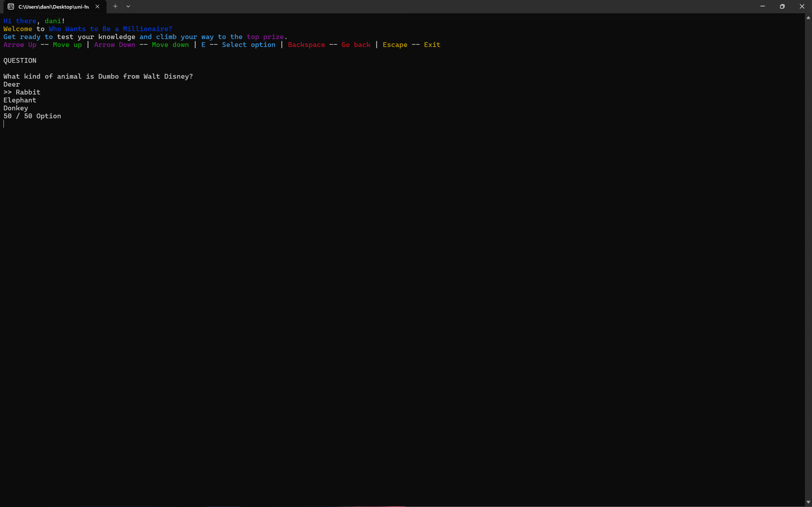
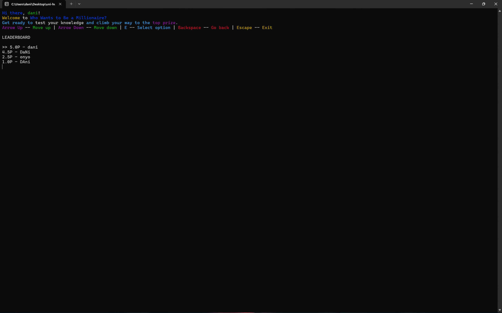

# Who Wants to Be a Millionaire - C CLI App

A command-line implementation of the popular quiz game **Who Wants to Be a Millionaire**, written in C.  

---

## Features

- 15 single-choice questions per game.
- CLI-based interface using **Windows API** (`windows.h`) for:
  - Clearing the terminal
  - Colored text
  - Menu navigation with arrow keys, Enter, and Backspace
- Uses **pointers** and **structs** for efficient data management.
- Persistent storage via CSV files:
  - `questions.csv` – stores all quiz questions and answers
  - `users.csv` – stores registered user information
  - `runs.csv` – keeps score history and leaderboard
- Interactive menu for:
  - Starting a new game
  - Viewing scoreboard/history
  - Navigating questions and answers

---

## Screenshots

### Login

### Main Menu

### Game Screen

### Question Example

### Leaderboard

---

## Requirements

- Windows OS (for `windows.h` API support)

---

